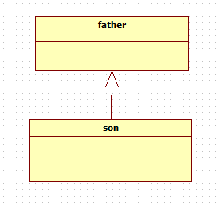
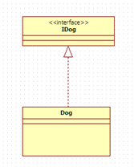
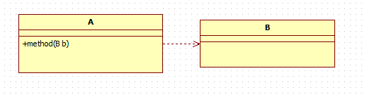
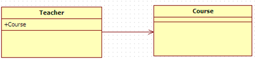
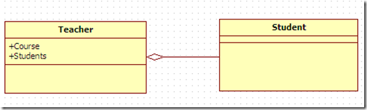
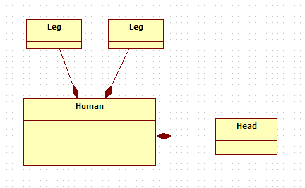

1 泛化
概念：泛化表示一个更泛化的元素和一个更具体的元素之间的关系。泛化是用于对继承进行建模的UML元素。在Java中，用extends关键字表示。

表示方式：用实线空心箭头表示。

注意：箭头方向是子类指向父类。

2 实现
概念：实现是一种类与接口的关系，表示类是接口所有特征和行为的实现，在程序中一般通过类实现接口来描述。

表示方式：用虚线空心三角形箭头表示，实现类指向接口。

3 依赖
概念：是一种使用的关系，即一个类的实现需要另一个类的协助。在Java中，方法参数需要传入另一个类的对象，就表示依赖这个类。

表示方式：虚线箭头。

注意：类A需要用到类B，类A指向类B。

4 关联
概念：表示类与类之间的联接,它使一个类知道另一个类的属性和方法，这种关系比依赖更强、不存在依赖关系的偶然性、关系也不是临时性的，一般是长期性的。

在Java中，一个类的全局变量引用了另一个类，就表示关联了这个类

表示方式：实线箭头。

注意：类A中用到类B属性，类A指向类B。

5 聚合
概念：聚合关联关系的一种特例，是强的关联关系。聚合是整体和个体之间的关系，即has-a的关系，整体与个体可以具有各自的生命周期，部分可以属于多个整体对象，也可以为多个整体对象共享。
     程序中聚合和关联关系是一致的，只能从语义级别来区分。

表示方式：尾部为空心菱形的实线箭头（也可以没箭头）。

注意：类A中用到类B属性，类A指向类B。

6 组合
概念：组合也是关联关系的一种特例。组合是一种整体与部分的关系，即contains-a的关系，比聚合更强。
     部分与整体的生命周期一致，整体的生命周期结束也就意味着部分的生命周期结束，组合关系不能共享。程序中组合和关联关系是一致的，只能从语义级别来区分。

表示方式：尾部为实心菱形的实现箭头（也可以没箭头）。

注意：Leg是Human的一部分，Human指向Leg。

